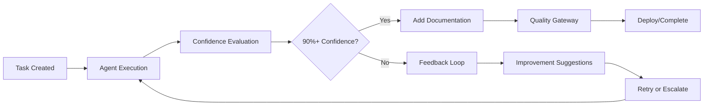

# 🤖 Debo - The Future of Autonomous Development

<div align="center">


[](https://github.com/Kevin-Kurka/Debo/releases)
[](LICENSE)
[](https://nodejs.org)
[](https://github.com/Kevin-Kurka/Debo)

**The world's first truly autonomous development system with Fortune 500 enterprise architecture**

*From idea to production in minutes, not hours*

[🚀 One-Line Install](#-one-line-installation) • [📖 Documentation](#-documentation) • [🎯 Examples](#-examples) • [🌟 Features](#-why-debo-is-revolutionary)

</div>

---

## 🚀 One-Line Installation

```bash
curl -fsSL https://raw.githubusercontent.com/Kevin-Kurka/Debo/main/install-autonomous.sh | bash
```

**That's it!** Debo installs everything, configures your system, downloads AI models, and is ready to build applications in under 5 minutes.

---

## 🌟 Why Debo is Revolutionary

Debo isn't just another AI coding assistant – it's a **complete autonomous development system** that mimics a Fortune 500 tech company structure. Here's why it's the future of software development:

### 🏢 **Enterprise-Grade Architecture**
Unlike single-agent tools, Debo operates like a real tech company with specialized AI agents:
- **CTO**: Strategic planning and architectural decisions  
- **Solution Architect**: System design and technical leadership
- **Engineering Manager**: Sprint planning and team coordination
- **Backend/Frontend Developers**: Code implementation
- **QA Engineers**: Testing and quality assurance
- **DevOps**: Deployment and infrastructure
- **Security Engineers**: Vulnerability scanning and compliance

### 🎯 **90% Confidence Guarantee**
Debo is the **only** AI system that guarantees code quality:
- **Multi-Criteria Evaluation**: Every piece of code is evaluated on 6+ criteria
- **Confidence Threshold**: Nothing ships without 90%+ confidence
- **Feedback Loops**: Low-confidence solutions trigger automatic improvement cycles
- **Smart Escalation**: Complex problems automatically escalate to thinking agents

### 🔄 **Anti-Circular Error Logic**
Debo prevents the infinite bug-fix loops that plague other AI tools:
- **Error Pattern Recognition**: Tracks all errors and solution attempts
- **Duplicate Prevention**: Blocks repeated failed solutions
- **Circular Detection**: Identifies and breaks infinite fix cycles
- **Architectural Escalation**: Complex errors trigger higher-level review

### 📝 **Self-Documenting Code**
Every file Debo creates includes:
- **Comprehensive Headers**: Purpose, features, dependencies explained
- **Intelligent TODOs**: Prioritized improvement suggestions
- **Technical Analysis**: Complexity and integration notes
- **Real-Time Feedback**: Terminal shows exactly what's being built

---

## 🚀 What Makes Debo Different

| Feature | Debo | GitHub Copilot | Cursor | Claude/ChatGPT | Cline |
|---------|------|----------------|--------|----------------|-------|
| **Autonomous Project Creation** | ✅ Complete | ❌ No | ❌ No | ❌ No | ❌ No |
| **Multi-Agent Architecture** | ✅ Fortune 500 | ❌ Single | ❌ Single | ❌ Single | ❌ Single |
| **90% Confidence Guarantee** | ✅ Yes | ❌ No | ❌ No | ❌ No | ❌ No |
| **Error Circular Prevention** | ✅ Yes | ❌ No | ❌ No | ❌ No | ❌ No |
| **Auto Documentation** | ✅ Complete | ❌ No | ❌ Limited | ❌ No | ❌ No |
| **Real-Time Monitoring** | ✅ Full Dashboard | ❌ No | ❌ No | ❌ No | ❌ No |
| **One-Command Deployment** | ✅ Yes | ❌ No | ❌ No | ❌ No | ❌ No |
| **Model Auto-Upgrade** | ✅ Yes | ❌ No | ❌ No | ❌ No | ❌ No |
| **MCP Integration** | ✅ Full | ❌ No | ❌ Limited | ❌ No | ❌ Limited |
| **Enterprise Architecture** | ✅ Yes | ❌ No | ❌ No | ❌ No | ❌ No |

---

## 🎯 Examples

### 🚀 **Create a Full-Stack App in 60 Seconds**

```bash
# Create a complete e-commerce platform
debo "Create an e-commerce app with React frontend, Node.js backend, user auth, shopping cart, payment integration, and admin dashboard"

# Watch the magic happen in real-time
debo monitor ecommerce-app

# Deploy to production when ready
debo deploy ecommerce-app production
```

**What happens autonomously:**
1. **CTO** analyzes requirements and creates architectural plan
2. **Solution Architect** designs system architecture and API specifications  
3. **Product Manager** breaks down features into user stories
4. **Backend Developer** creates APIs, database models, authentication
5. **Frontend Developer** builds React components, pages, and integrations
6. **QA Engineer** creates comprehensive test suites
7. **DevOps** sets up deployment pipeline and infrastructure
8. **Security** scans for vulnerabilities and implements best practices

### 🔧 **Add Complex Features**

```bash
# Add sophisticated features with natural language
debo "Add real-time chat with WebSocket, message encryption, file sharing, and emoji reactions"

# Debo understands context and implements perfectly
debo "Optimize the database queries and add Redis caching"

# Even handles DevOps tasks
debo "Set up CI/CD pipeline with automated testing and deployment"
```

### 🛠️ **System Integration**

```bash
# Automatically setup development tools
debo "Setup GitHub integration with automatic PR creation"
debo "Connect to Stripe for payment processing"
debo "Add Sentry for error monitoring"

# Debo handles all configuration automatically
```

---

## 💡 Why Developers Choose Debo

### **🎯 For Individual Developers**
- **Build 10x Faster**: Complete applications in minutes instead of days
- **Learn While Building**: Each file includes educational comments explaining the code
- **Never Get Stuck**: Automatic error resolution and solution suggestions
- **Production Ready**: Built-in testing, security, and deployment

### **🏢 For Development Teams**
- **Consistent Architecture**: Enterprise-grade patterns and best practices
- **Knowledge Sharing**: Self-documenting code reduces onboarding time
- **Quality Assurance**: 90% confidence threshold ensures reliable code
- **Scalable Processes**: Fortune 500 development methodology

### **🚀 For Startups**
- **Rapid Prototyping**: MVP to production in hours, not weeks
- **Cost Effective**: One developer can build enterprise-grade applications
- **Technical Debt Avoidance**: Quality-first approach prevents future problems
- **Investor Ready**: Professional architecture and documentation

---

## 🛠️ Installation & Setup

### **Prerequisites**
- **Operating System**: macOS, Linux, or Windows WSL2
- **Memory**: 8GB RAM minimum (16GB recommended)
- **Storage**: 10GB free space
- **Network**: Internet connection for AI model downloads

### **Automatic Installation**
```bash
# One command installs everything
curl -fsSL https://raw.githubusercontent.com/Kevin-Kurka/Debo/main/install-autonomous.sh | bash
```

**What gets installed:**
- ✅ Node.js 18+ and npm
- ✅ Redis for state management
- ✅ Ollama for local AI models
- ✅ Required AI models (qwen2.5:7b, qwen2.5:14b, deepseek-r1:1.5b)
- ✅ Debo system and all dependencies
- ✅ Global `debo` command
- ✅ Real-time monitoring dashboard

### **Manual Installation**
```bash
# Clone repository
git clone https://github.com/Kevin-Kurka/Debo.git
cd Debo

# Install dependencies
npm install

# Run setup
npm run setup

# Create global command
npm link
```

---

## 📖 Documentation

### **Core Commands**

```bash
# Project Management
debo create <name> "<description>" [stack]     # Create new project
debo develop <project> "<feature>"             # Add features
debo status <project>                          # Check progress
debo deploy <project> <environment>            # Deploy application

# System Management  
debo monitor [project]                         # Real-time dashboard
debo analyze <project>                         # Quality analysis
debo maintain <project> "<tasks>"              # Maintenance tasks

# Advanced Features
debo "setup GitHub MCP server"                # Tool integration
debo "check for model upgrades"                # AI model management
debo "connect to OpenAI API"                   # External AI services
```

### **Natural Language Interface**

Debo understands natural language commands:

```bash
# Project Creation Examples
debo "Build a social media app like Twitter with React and real-time feeds"
debo "Create a task management system with drag-and-drop and team collaboration"  
debo "Make a cryptocurrency portfolio tracker with live prices and charts"

# Feature Development Examples
debo "Add two-factor authentication to the login system"
debo "Implement dark mode with user preference persistence"
debo "Create an admin dashboard with analytics and user management"

# Integration Examples  
debo "Setup automated testing with Jest and Cypress"
debo "Add monitoring with Prometheus and Grafana"
debo "Configure deployment to AWS with auto-scaling"
```

### **Real-Time Monitoring**

Access the web dashboard at `http://localhost:3001` for:
- 📊 **Live Progress Tracking**: See exactly what each agent is working on
- 🎯 **Confidence Metrics**: Real-time confidence scores for all tasks
- 🚨 **Error Monitoring**: Track and resolve issues as they occur
- 📝 **Code Documentation**: View generated TODOs and file purposes
- 🚀 **Deployment Status**: Monitor builds and deployments

---

## 🏗️ Architecture Deep Dive

### **Agent Hierarchy**

```
🏢 Fortune 500 Structure
├── 🧠 Strategic Layer (Thinking Agents)
│   ├── CTO (Overall strategy and vision)
│   ├── Solution Architect (Technical design)
│   ├── Product Manager (Feature prioritization)
│   └── Engineering Manager (Team coordination)
└── ⚡ Execution Layer (Fast Agents)
    ├── Backend Developer (API and logic)
    ├── Frontend Developer (UI and UX)
    ├── QA Engineer (Testing and quality)
    ├── DevOps Engineer (Infrastructure)
    ├── Security Engineer (Security and compliance)
    └── Technical Writer (Documentation)
```

### **Quality Assurance Pipeline**



### **Error Prevention System**

```
🚨 Error Tracking Database
├── Error Detection & Classification
├── Solution History & Pattern Recognition  
├── Circular Pattern Prevention
├── Duplicate Solution Blocking
└── Automatic Escalation to Architects
```

---

## 🚀 Advanced Features

### **🧠 Model Evolution System**
- **Automatic Discovery**: Monitors latest AI models from Ollama, Hugging Face
- **Performance Testing**: Evaluates new models on coding, reasoning, and thinking tasks
- **Confidence-Based Upgrades**: Only upgrades when 80%+ confident the new model is better
- **Rollback Protection**: Automatically reverts if new models underperform

### **🔧 MCP Integration Engine**
- **Universal Compatibility**: Connects to any Model Context Protocol server
- **Auto-Configuration**: Natural language setup ("setup GitHub integration")
- **Credential Management**: Secure storage and rotation of API keys
- **Health Monitoring**: Continuous monitoring of connected services

### **📊 Real-Time Analytics**
- **Development Velocity**: Track features completed per hour/day
- **Quality Metrics**: Confidence scores, error rates, test coverage
- **Agent Performance**: Individual agent productivity and success rates
- **Project Health**: Overall project status and technical debt

### **🛡️ Enterprise Security**
- **Vulnerability Scanning**: Automatic security analysis of all generated code
- **Compliance Checking**: Built-in compliance with security standards
- **Access Control**: Role-based permissions for team environments
- **Audit Logging**: Complete audit trail of all development activities

---

## 🌍 Community & Support

### **📚 Learning Resources**
- [📖 Complete Documentation](https://github.com/Kevin-Kurka/Debo/wiki)
- [🎥 Video Tutorials](https://github.com/Kevin-Kurka/Debo/wiki/tutorials)
- [💡 Best Practices Guide](https://github.com/Kevin-Kurka/Debo/wiki/best-practices)
- [🔧 Troubleshooting](https://github.com/Kevin-Kurka/Debo/wiki/troubleshooting)

### **🤝 Contributing**
- [Contributing Guidelines](CONTRIBUTING.md)
- [Code of Conduct](CODE_OF_CONDUCT.md)
- [Issue Templates](.github/ISSUE_TEMPLATE/)
- [Pull Request Process](.github/PULL_REQUEST_TEMPLATE.md)

### **💬 Community**
- [GitHub Discussions](https://github.com/Kevin-Kurka/Debo/discussions)
- [Discord Server](https://discord.gg/debo) *(Coming Soon)*
- [Stack Overflow](https://stackoverflow.com/questions/tagged/debo)

---

## 🗺️ Roadmap

### **🚀 Version 2.1 (Q2 2024)**
- [ ] **Mobile Development**: React Native and Flutter support
- [ ] **Cloud Integration**: Native AWS, GCP, Azure deployment
- [ ] **Team Collaboration**: Multi-developer project support
- [ ] **Advanced Testing**: Visual regression and performance testing

### **🌟 Version 2.2 (Q3 2024)**
- [ ] **Custom Agents**: User-defined specialized agents
- [ ] **API Marketplace**: Community-contributed integrations  
- [ ] **Visual Designer**: Drag-and-drop UI builder
- [ ] **Analytics Dashboard**: Advanced project analytics

### **🚀 Version 3.0 (Q4 2024)**
- [ ] **Multi-Language Support**: Python, Java, Go, Rust backends
- [ ] **Microservices Architecture**: Distributed system generation
- [ ] **AI Model Training**: Custom model fine-tuning
- [ ] **Enterprise Edition**: Advanced team features

---

## 📜 License

This project is licensed under the MIT License - see the [LICENSE](LICENSE) file for details.

---

## 🙏 Acknowledgments

- Built with inspiration from Fortune 500 development practices
- Powered by state-of-the-art AI models from Ollama and OpenAI
- Special thanks to the open-source community for foundational tools
- Inspired by the vision of autonomous software development

---

<div align="center">

**🚀 Ready to revolutionize your development workflow?**

```bash
curl -fsSL https://raw.githubusercontent.com/Kevin-Kurka/Debo/main/install-autonomous.sh | bash
```

[⭐ Star this repo](https://github.com/Kevin-Kurka/Debo) • [🐛 Report issues](https://github.com/Kevin-Kurka/Debo/issues) • [💡 Request features](https://github.com/Kevin-Kurka/Debo/issues/new?template=feature_request.md)

**Join the autonomous development revolution!**

</div>